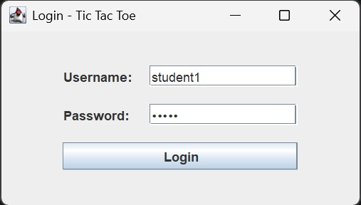
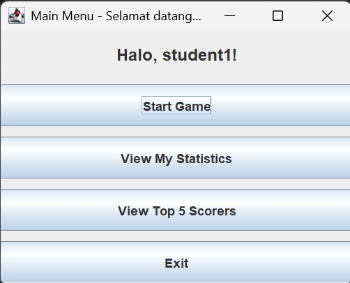
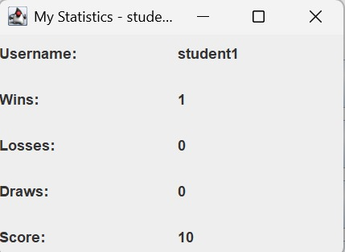
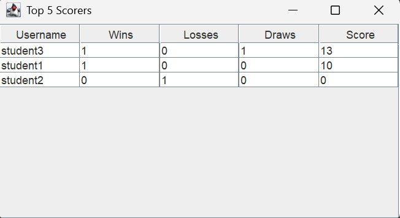
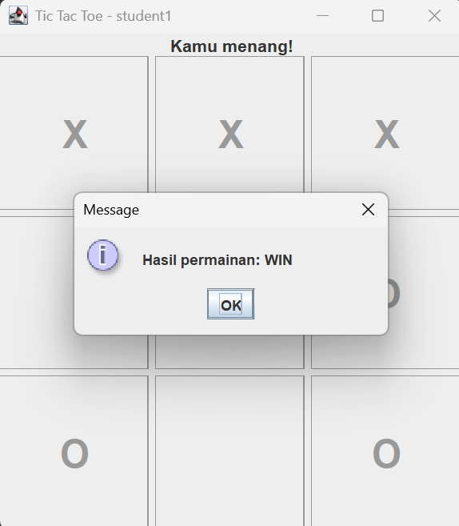

# Simple Tic-Tac-Toe Game with Java Swing, Login, and Statistics

## Student Information
Name: (Nastiti Ayu Lestari)
Student ID: (5026251020)
Class: ES234211 - Programming Fundamental

## Project Description
This project is a simple Tic-Tac-Toe game built using Java Swing.
The application includes a login system, game statistics tracking,
and a Top 5 scorer feature, all connected to a one-table relational
database (MySQL).

## Features
- Login using database (username & password checked against `players` table)
- Play Tic-Tac-Toe against a simple computer opponent using Swing GUI
- Detect win, lose, and draw conditions
- Record wins, losses, draws, and total score after every game
- Display personal statistics (My Statistics window)
- Display Top 5 scorers using JTable, ordered by score then wins

## Database
Database used: MySQL
Table: `players` (id, username, password, wins, losses, draws, score)
This project uses **one table only**, as required by the assignment.

## How to Run
1. Install MySQL and make sure the MySQL service is running.
2. Open a MySQL client (Workbench / terminal) and run `database/schema.sql`
   to create the database and the `players` table with sample users.
3. Open the project in your Java IDE (IntelliJ / Eclipse / VS Code).
4. Add the MySQL JDBC driver (`mysql-connector-j-x.x.x.jar`) to the project's classpath.
5. Open `DatabaseManager.java` and adjust `URL`, `USER`, and `PASSWORD`
   to match your own MySQL configuration.
6. Run `Main.java`.
7. Log in using one of the sample accounts from `schema.sql`
   (e.g. username: `student1`, password: `12345`).

## Class Explanation
- **Main** — entry point, opens the LoginFrame.
- **DatabaseManager** — handles the JDBC connection to MySQL.
- **Player** — model class storing one player's data (id, username, wins, losses, draws, score).
- **PlayerService** — handles login checking, updating statistics, and retrieving Top 5 scorers from the database.
- **GameLogic** — handles move validation, win/draw checking, and the computer's (random) move.
- **LoginFrame** — Swing window for entering username and password.
- **MainMenuFrame** — Swing window for navigating to Game, Statistics, Top Scorers, or Exit.
- **GameFrame** — Swing window where the Tic-Tac-Toe game is played; connects button clicks to `GameLogic` and updates the database when the game ends.
- **StatisticsFrame** — Swing window showing the logged-in player's personal statistics.
- **TopScorersFrame** — Swing window showing the Top 5 scorers using `JTable`.

## Screenshots
## Login

## Main Menu

## Statistics

## Top 5 Scorers

## Game

## Video Link
YouTube: (https://youtu.be/HOI5HiwbPtc)

